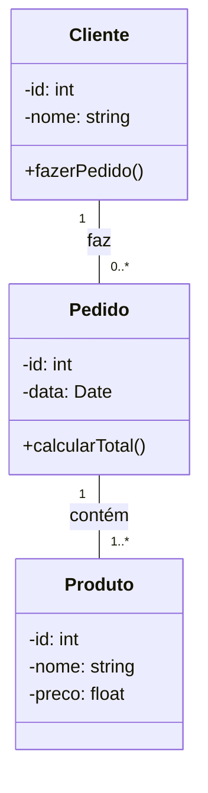
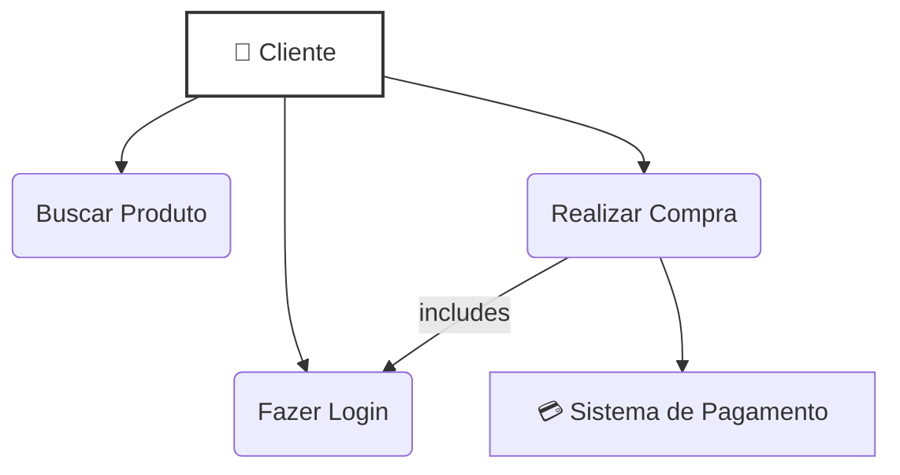
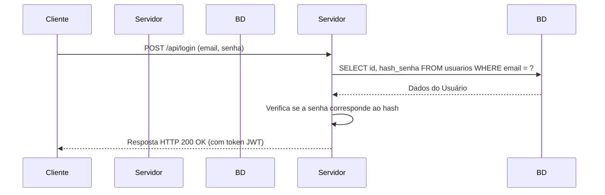

# 📈 UML: A Linguagem de Modelagem Unificada

A **UML (Unified Modeling Language)**, ou Linguagem de Modelagem Unificada, é uma linguagem gráfica padronizada para visualizar, especificar, construir e documentar os artefatos de um sistema de software. Em termos simples, a UML é para o software o que as plantas são para a construção de um edifício.

É crucial entender que a UML **não é uma linguagem de programação**. Ela é uma linguagem **visual** usada para criar "plantas" (diagramas) que descrevem um sistema de software de diferentes perspectivas. Mantida pelo Object Management Group (OMG), seu principal objetivo é fornecer uma notação padrão que possa ser compreendida por todos os envolvidos no projeto — desenvolvedores, arquitetos, analistas de negócios e clientes.

### Para Que Serve?

  - **Visualizar a Arquitetura**: Permite que as equipes vejam a estrutura e o comportamento do sistema antes de escrever uma única linha de código.
  - **Melhorar a Comunicação**: Cria uma linguagem comum para que todos os stakeholders possam discutir o sistema de forma clara e sem ambiguidades.
  - **Identificar Problemas de Design**: Modelar um sistema pode revelar falhas lógicas, gargalos de performance e outros problemas de design em uma fase inicial, quando são mais baratos de corrigir.
  - **Documentar o Sistema**: Os diagramas UML servem como uma documentação viva da arquitetura e da funcionalidade do software.

-----

## As Duas Grandes Categorias de Diagramas

Os diagramas UML são divididos em duas categorias principais, cada uma oferecendo uma visão diferente do sistema.

1.  **Diagramas Estruturais (Structural Diagrams)**: Mostram a **estrutura estática** do sistema. Eles descrevem os componentes que formam o sistema e os relacionamentos entre eles. Respondem à pergunta: **"O que é o sistema?"**
2.  **Diagramas Comportamentais (Behavioral Diagrams)**: Mostram o **comportamento dinâmico** do sistema. Eles descrevem como os componentes interagem entre si ao longo do tempo para realizar uma função. Respondem à pergunta: **"O que o sistema faz e como ele faz?"**

-----

## 🏛️ Diagramas Estruturais: A Anatomia do Sistema

Esses diagramas representam os "ossos" e os "órgãos" do seu software.

### Diagrama de Classes (Class Diagram)

É o diagrama mais comum da UML e a espinha dorsal de qualquer sistema orientado a objetos. Ele descreve a estrutura do sistema mostrando suas classes, atributos, métodos (operações) e os relacionamentos entre as classes (como herança, associação e agregação).

**Exemplo Simples (Sistema de Pedidos):**

*Este diagrama mostra que um `Cliente` pode fazer de zero a muitos `Pedidos`. Cada `Pedido` deve conter um ou mais `Produtos`.*

### Diagrama de Componentes (Component Diagram)

Mostra como um sistema é dividido em componentes de alto nível (como bibliotecas, arquivos executáveis, APIs) e as dependências entre eles. É útil para visualizar a arquitetura física do sistema.

-----

## ⚙️ Diagramas Comportamentais: A Dinâmica do Sistema

Esses diagramas mostram o software em ação.

### Diagrama de Casos de Uso (Use Case Diagram)

Descreve a funcionalidade de um sistema do ponto de vista do usuário. Ele modela as interações entre os **atores** (usuários ou outros sistemas) e os **casos de uso** (as ações que eles podem realizar). É excelente para definir os requisitos de um sistema.

**Exemplo (E-commerce):**

*Este diagrama mostra que o `Cliente` pode `Realizar Compra`, o que "inclui" a necessidade de `Fazer Login`. A compra também interage com um sistema externo, o `Sistema de Pagamento`.*

### Diagrama de Sequência (Sequence Diagram)

Mostra como os objetos interagem entre si em uma ordem cronológica para realizar um cenário específico. É perfeito para detalhar o fluxo de um caso de uso, mostrando as mensagens trocadas entre os objetos ao longo do tempo.

**Exemplo (Fluxo de Login):**

*Este diagrama detalha passo a passo a comunicação entre o `Cliente`, o `Servidor` e o `Banco de Dados` durante um processo de login bem-sucedido.*

-----

## 🤔 UML no Desenvolvimento Ágil Moderno

No passado, a UML era associada a processos de desenvolvimento pesados (como o "waterfall"), onde toda a documentação era criada antes do início da codificação. No entanto, no desenvolvimento ágil moderno, a UML encontrou um novo propósito.

Hoje, ela é usada menos para documentação exaustiva e mais como uma **ferramenta de comunicação e design colaborativo**. A prática mais comum é o **"Whiteboard UML"**: esboçar rapidamente um diagrama de classes ou de sequência em um quadro branco (ou em uma ferramenta digital) durante uma reunião para discutir e validar uma ideia com a equipe antes de implementá-la. É uma ferramenta para **pensar e alinhar**, não apenas para documentar.

-----

## 🚀 Começando com UML

Você não precisa de softwares caros e complexos para começar a usar UML.

  - **A Prancheta ou Quadro Branco**: A melhor ferramenta para discussões em equipe.
  - **Ferramentas de Diagramação Online**: Ferramentas gratuitas e fáceis de usar como **diagrams.net** (antigo draw.io) e **Lucidchart** (com plano gratuito).
  - **Ferramentas Baseadas em Texto**: Permitem que você escreva seus diagramas como código, o que é ótimo para versionamento com Git.
      - **Mermaid**: Integrado em muitas plataformas Markdown como GitHub e GitLab.
      - **PlantUML**: Uma ferramenta poderosa e popular com suporte a muitos tipos de diagramas.